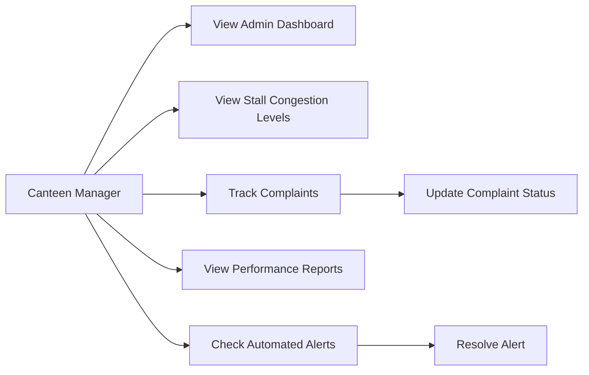

# FoodQ Manager Module Documentation

## Scope

This part implements only the Manager side of FoodQ. Customer functions such as login, registration, browsing stalls, pre-ordering, order tracking, and reviews are handled by the Auth + Customer member. Vendor functions such as order management, menu updates, inventory control, push notifications, and sales analytics are handled by the Vendor member.

The Manager module focuses on basic canteen administration features:

1. Admin Dashboard
2. Stall congestion levels
3. Complaint tracking
4. Performance reports
5. Automated alerts

## Functional Requirements

| Manager Function | Basic Implementation |
| --- | --- |
| Admin Dashboard | Shows total active orders, total queue count, open complaints, active alerts, and stall overview. |
| Stall Congestion Levels | Shows each stall's queue count, estimated wait time, and congestion level as Low, Medium, or High. |
| Complaint Tracking | Shows customer complaints and allows the manager to mark complaints as In Progress or Resolved. |
| Performance Reports | Shows total sales, total orders, top stall, average rating, and stall performance list. |
| Automated Alerts | Shows basic alerts for congestion, complaints, and report readiness. Manager can run an alert check and resolve alerts. |

## Use Case Diagram

## Basic Process Flow

### Admin Dashboard

1. Manager opens the FoodQ Manager app.
2. System displays total orders, queue count, complaints, and alerts.
3. Manager checks the stall overview to understand current canteen condition.

### Stall Congestion Levels

1. Manager opens the Congestion tab.
2. System displays queue count and wait time for each stall.
3. System labels congestion as Low, Medium, or High.
4. Manager can send a simple redirect notice when a stall is crowded.

### Complaint Tracking

1. Manager opens the Complaints tab.
2. System displays submitted complaint records.
3. Manager changes the complaint status to In Progress.
4. Manager changes the complaint status to Resolved after handling the issue.

### Performance Reports

1. Manager opens the Reports tab.
2. System displays total sales, total orders, top stall, and average rating.
3. Manager reviews each stall's basic performance.

### Automated Alerts

1. Manager opens the Alerts tab.
2. System displays current alert records.
3. Manager presses Run Alert Check.
4. System creates alerts when congestion or open complaints exist.
5. Manager marks alerts as resolved after checking them.

## Mock Data Used

The current app uses local mock data for demonstration. This keeps the Manager part simple and suitable for Part 2 demonstration without requiring Firebase setup.

Main mock data:

- Stall name
- Queue count
- Wait time
- Active orders
- Sales
- Rating
- Complaint status
- Alert status

## Test Cases

| Test Case | Steps | Expected Result |
| --- | --- | --- |
| Open dashboard | Launch app and stay on Dashboard tab | Summary cards and stall overview are shown. |
| Check congestion | Tap Congestion tab | Stall queue and wait time are shown with congestion labels. |
| Send redirect notice | Tap Send Redirect Notice | Snackbar confirms manager notice. |
| Track complaint | Tap Complaints tab | Complaint records are shown. |
| Update complaint | Tap In Progress or Resolve | Complaint status changes immediately. |
| View reports | Tap Reports tab | Sales, orders, top stall, rating, and stall list are shown. |
| Run alert check | Tap Alerts tab, then Run Alert Check | New alert appears if congestion or open complaints exist. |
| Resolve alert | Tap Resolve beside an active alert | Alert changes to resolved state. |
